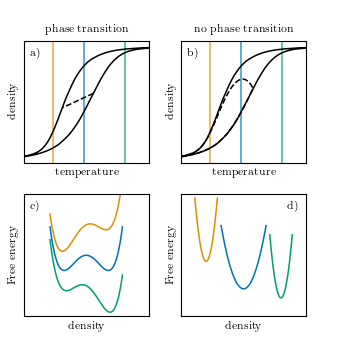
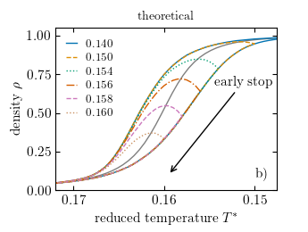
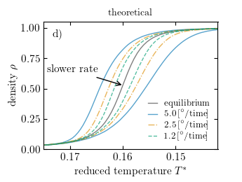
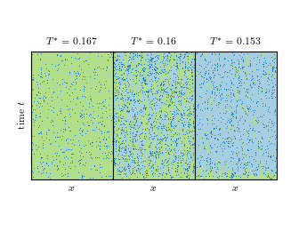

# MOF analysis

### Prerequisites

You will need the modules

```
git clone https://github.com/zpreisler/modules.git
```

go to the directory and build and install

```
python setup.py build
python setup.py install --user
```

### schematics


### quench


### rates


### evolution

